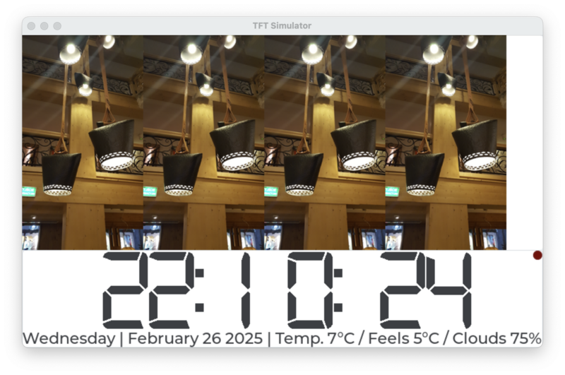

### Raspberry Pi Panel with 7'' LCD
---



Format of `panel.ini` configuration file:

```
openweather_apikey = "<openweather-api-key>"
openweather_coord = {52.4069, 16.9299}
openweather_label = "Poznan"
```

#### Reference
  1. https://wallpaperaccess.com/blue-color-hd
  2. https://wallpapercave.com/blue-color-wallpapers
  3. https://itnext.io/raspberry-pi-read-only-kiosk-mode-the-complete-tutorial-for-2021-58a860474215
